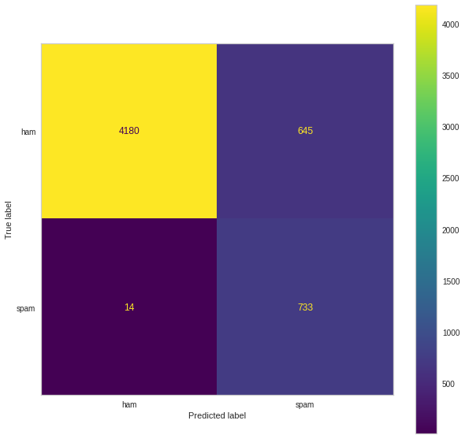

## The problem of SMS Phishing (Smishing)

Email spam has been a solved problem for at least 10 years. As any user of Gmail will tell you, the only time they see spam emails is the occasional time they curiously dip into their spam folder and chuckle at the all-to-obvious clichés used by scammers.

However, there is another type of spam that is on the rise and seems to be poorly addressed by Big Tech until now. That is SMS phishing (somewhat adorably called Smishing). You have likely received smishing messages, they often refer to some tax refund that you're due, a parcel that you need to claim or some too-good-to-be-missed offer that you can avail yourself of.

The fact that email spam is rarely encountered by the average user nowadays, except for very sophisticated or targeted attacks, means our guard can be down and the risk of falling for such messages is higher.

With the risk of generalising, in my own experience, I find that those generations who were not active on the web from their early formative years can be less sensitive to the signals that help to detect smishing messages.

For instance: suspicious domains: `hmrc.gov.uk` vs `hmrc.tax-refund.co.uk` might not raise immediate red flags for some as they do for others.

Another issue with the average spam filter is they do nothing to educate the user. A binary flagging of spam/ham helps to protect but it does not equip a user with the knowledge to recognise such malicious messages themselves.

## Using GPT-4 to Identify and Prevent Spam: Helping Users Stay Safe and Secure

I recently got access to the GPT-4 API and from initial experiments was impressed with the advance made compared to the earlier models. I decided to try this out for the Smishing detector/educator use case.

The first thing I decided to try was to see how well GPT-4 performed as a simple binary classifier against a public dataset of SMS phishing messages. I used this [SMS Spam Collection Dataset](https://www.kaggle.com/datasets/uciml/sms-spam-collection-dataset) from Kaggle. It's quite an unbalanced dataset with 13% spam and 87% ham and from eyeballing the text there seems to be a lot of Colloquial Singaporean English but it's a good start.

You can train a classifier on this dataset and get very good accuracy with many methods, such as naive Bayes, Random Forest etc but I was curious what metrics I could get simply by asking GPT-4 is this spam or ham?

You can see the Colab notebook where I ran this test here: https://colab.research.google.com/drive/1-lzIg7_FENR95uFet7-ZgSjXTq3-U96w?usp=sharing. You will need an OpenAI API key and GPT-4 access.

### Results

| Metric      | Score |
| ----------- | ----- |
| Accuracy    | 92.4% |
| Precision   | 76.4% |
| Recall      | 92.4% |
| F1 Score    | 80.8% |
| Sensitivity | 98.1% |

### Confusion Matrix

Although this is without a doubt, not the best-performing classifier one could build for the dataset, let's remember there was no training step here. Not even few-shot prompting. We simply prompted the model "Is this Spam". In the case of spam recognition, sensitivity is the important metric, we want to ensure actual spam is recognised as spam and 98.1% is a very good result.

Another factor to consider is when we receive an SMS there is a human classifier in the form of our intuition, not to mention the recognition (or lack) of the sender's number. This stacked with the above GPT-4 classifier should create a robust filter which would mitigate the number of false negatives.

## More than a classifier

Although the classifier performs pretty well at answering the binary spam/ham question, we can do much better. To assist a user in future we can provide an analysis of why the decision was made. This is where GPT-4 really shines!

## Providing a usable interface

To allow people to access this model as a service in a simple way, the easiest interface is an SMS bot. When a user receives a suspicious-looking email they can forward the SMS to a phone number. The model will run in response to the receipt of the message and reply with its opinion and an explanation of how it arrived at the result.

I used [ClickSend](https://dashboard.clicksend.com/#/dashboard/home) to build a quick prototype of this, it's very easy to get set up and test SMS integrations, although their JavaScript tooling has something to be desired.

> When I first started testing this I had my account blocked on ClickSend due to the content of the messages I was sending it, pretty understanably. However I reached out via email and I was very quickly reinstated when I explained my use case.

I simply have any inbound SMS on a number I purchased (in my case a UK mobile number) sent to an endpoint. In that endpoint, I read the sender's number and message. I then call the GPT-4 chat completion endpoint and when I receive the result, I forward it to the user.

I used [Next.js](https://nextjs.org/) for this because coupled with [`vercel deploy`](https://vercel.com/) it's just the easiest, most pleasant way to stand up a web application in the current era in my opinion.

The code to implement the entire flow is embarrassingly little:

